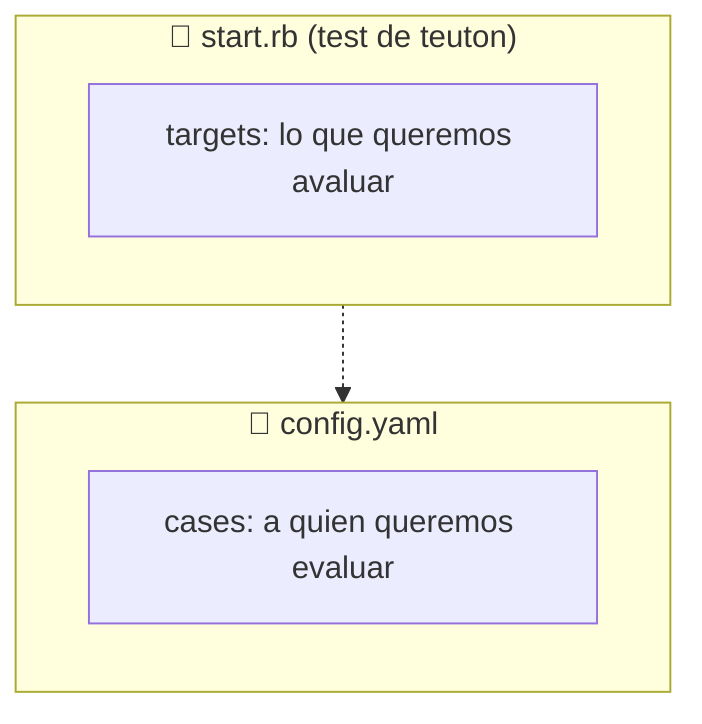

# Tutorial: Nginx Web Server

Vamos a hacer un tutorial de cómo crear un test para checkear la instalación de un servidor web Nginx.

Esquema de clase:


> Enlaces de interés:
>
> * URL tutorial: https://github.com/dvarrui/charlas/blob/main/teuton/nginx/docs/index.md
> * URL Teuton: https://github.com/teuton-software/teuton

## 1. Consultamos a la IA generativa

_¿Cómo no? En estos tiempos todo el mundo está hablando de la IA generativa. Así que vamos a usarla para que nos ayude con el test de Teuton? ;-)_

* Abro Gemini y le pongo el siguiente prompt:

```
Usando la siguiente plantilla de ejemplo de la herramienta Teuton:

 group "Learn about targets" do
  target "Create user obiwan", weight: 2
  run "id obiwan"
  expect ["uid=", "(obiwan)", "gid="]

  target "Delete user vader"
  run "id vader"
  expect_fail
end

start do
  show
  export
end

quiero que hagas un test para evaluar que tenemos activo el servicio web nginx 
y que la página principal index.html tiene en su contenido el texto "Hola Mundo!"
```

* La respuesta de Gemini es un buen inicio:

```ruby
group "Nginx Web Service Checks" do

  # Objetivo 1: Verificar que el servicio Nginx está activo
  # Se asume que el comando 'systemctl status' está disponible (en sistemas Linux basados en systemd)
  target "Check Nginx service status", weight: 3
  
  # Comando para verificar el estado del servicio
  run "systemctl status nginx" 
  
  # Expectativa: La salida del comando debe contener el texto "Active: active (running)"
  # para confirmar que el servicio está en ejecución.
  expect ["Active: active (running)"]


  # Objetivo 2: Verificar el contenido de la página principal (index.html)
  # Se asume que la página index.html está en el directorio raíz de Nginx (/var/www/html/ o similar)
  target "Check index.html content for 'Hola Mundo!'", weight: 5
  
  # Comando para leer el contenido del archivo de la página principal
  # NOTA: Ajusta la ruta del archivo si tu configuración Nginx es diferente.
  run "cat /var/www/html/index.html" 
  
  # Expectativa: El contenido del archivo debe incluir el texto exacto "Hola Mundo!"
  expect ["Hola Mundo!"]
end

start do
  show 
  export 
end
```

## 2. Refinamos manualmente

Vamos a realizar algunos cambios manualmente:

* Vamos a poner los textos en español.
* Los textos de los comentarios que contengan información útil para el alumno, nos puede interesar incluirlos en el enunciado de la práctica. Para ello usamos la instrucción `readme`.
* El resto de los comentarios, me parecen evidentes, los elimino.
* En la instrucción `expect` podemos quitar los corchetes si sólo tenemos un filtro. Así, es más fácil de leer.
* El `readme` después del `group`es una aclaración de información del grupo, y el `readme` después del `target` es una aclaración de ese target concreto.

```ruby
group "Comprobar el servicio web Nginx" do
  readme "Necesitamos un SO GNU/Linux basado en systemd. Por ejemplo: OpenSUSE, Debian, etc"

  target "Comprobar el estado del servicio Nginx", weight: 3
  run "systemctl status nginx" 
  expect "Active: active (running)"

  target "Comprobar que index.html contiene el texto 'Hola Mundo!'", weight: 5
  readme "Se asume que Nginx está instalado en su ruta por defecto"
  run "cat /var/www/html/index.html" 
  expect "Hola Mundo!"
end

start do
  show 
  export 
end
```

> **NOTA**: Mientras estamos haciendo cambios en el test podemos usar los siguientes comandos para comprobar que todo va funcionando correctamente.
>
> * `teuton readme PATH/TO/FOLDER` para ver cómo se genera el enunciado asociado a la práctica.
> * `teutob check PATH/TO/FOLDER` para comprobar que no hay fallos en la sintaxis, etc.

## 3. Añadimos un fichero de configuración



* Para tener mayor legibilidad en el futuro, el primer refinamiento que vamos a realizar es separar los tests específicos de Nginx de las instrucciones del script principal. 
    1. `start.rb`: Script principal
    2. `nginx.rb`: Tests específicos de Nginx

```ruby
# File: start.rb (Script principal)
use "nginx"

start do
  show 
  export 
end
  
```

```ruby
# File: nginx.rb (Tests específicos de Nginx)

group "Comprobar el servicio web Nginx" do
  readme "* Necesitamos un SO GNU/Linux basado en systemd. Por ejemplo: OpenSUSE, Debian, etc."

  target "Comprobar el estado del servicio Nginx", weight: 3
  run "systemctl status nginx" 
  expect "Active: active (running)"

  target "Comprobar que index.html contiene el texto 'Hola Mundo!'", weight: 5
  readme "Se asume que Nginx está instalado en su ruta por defecto."
  run "cat /var/www/html/index.html" 
  expect "Hola Mundo!"
end
```

Ahora mismo, el test se ejecuta directamente en la máquina `localhost`, pero vamos a modificarlo para que se pueda ejecutar en las máquinas remotas de nuestros alumnos.
* Modificamos la instrucción `run` para indicar dónde se tiene que ejecutar el comando: `run COMMAND, on: :webserver`. El nombre de host `webserver` es completamente arbitrario. Lo ideal es poner algo significativo para nosotros como: `nginx` `server`, `host1`,  `linux`, etc. Cualquiera valdría.

```ruby
# File: nginx.rb (Tests específicos de Nginx)

group "Comprobar el servicio web Nginx" do
  readme "* Necesitamos un SO GNU/Linux basado en systemd. Por ejemplo: OpenSUSE, Debian, etc."

  target "Comprobar el estado del servicio Nginx", weight: 3
  run "systemctl status nginx", on: :webserver
  expect "Active: active (running)"

  target "Comprobar que index.html contiene el texto 'Hola Mundo!'", weight: 5
  readme "Se asume que Nginx está instalado en su ruta por defecto."
  run "cat /var/www/html/index.html", on: :webserver
  expect "Hola Mundo!"
end
```

Tenemos que incluir un fichero de configuración para especificar la configuración específica de cada una de las máquinas de nuestros alumnos, que son las que queremos evaluar realmente.

* A partir del contenido del test, Teuton es capaz de deducir los parámetros que se necesitan para su ejecución. Para ello usamos el comando `teuton config PATH/FOLDER`.

```yaml
---
global:
cases:
- tt_members: TOCHANGE
  webserver_ip: TOCHANGE
  webserver_username: TOCHANGE
  webserver_password: TOCHANGE
```

* Personalizamos los valores de los parámetros:

```yaml
---
global:
cases:
# Máquina del alumno 1
- tt_members: Alumno 1
  webserver_ip: 192.168.122.254
  webserver_username: user
  webserver_password: secret
```

## 4. Ejecutamos el test sobre las máquinas remotas

* Ahora vamos a ejecutar el test `teuton run PATH/TO/FOLDER`.

```
$ teuton run nginx/v02.remote 
------------------------------------
Started at 2025-12-05 23:10:38 +0000
FF
Finished in 0.674 seconds
------------------------------------
 
CASE RESULTS
+------+----------+-------+-------+
| CASE | MEMBERS  | GRADE | STATE |
| 01   | Alumno 1 | 0.0   | ?     |
+------+----------+-------+-------+
```

El alumno 1 tiene una nota final de 0. Esto es porque todavía no ha realizado la práctica.

Como profesores, mientras estamos diseñando el test, es muy útil tener una MV que haga de la máquina del alumno para ir haciendo las pruebas durante el proceso. Por motivos didácticos, vamos a añadir una segunda MV (del alumno2), para simular que tenemos un grupo de clase donde tenemos que a un alumno le sale la práctica mal y a otro bien.

* Ampliamos el fichero de configuración con 2 cases:

```yaml
# File: v02.remote/config.yaml
---
global:
cases:
# Máquina del alumno 1
- tt_members: Alumno 1
  webserver_ip: 192.168.122.254
  webserver_username: user
  webserver_password: secret
# Máquina del alumno 2
- tt_members: Alumno 2
  webserver_ip: 192.168.122.108
  webserver_username: user
  webserver_password: secret
```

> **NOTA**: 
> * Los valores de las IP son los de mis MV ahora pero pueden ser diferentes. 
> * Estoy usando el hipervisor KVM para crear las MV dentro de máquina real, pero se pueden usar otros como VirtualBox, Qemu, Parallel, Hyper-V, incluso contenedores con SSH en ejecución, máquinas reales, Raspberry PI, etc.

* Ejecutamos el test. De momento todas las notas están a 0 porque los alumnos todavía no han realizado la práctica:

```
$ teuton run nginx/v02.remote
------------------------------------
Started at 2025-12-06 16:25:10 +0000
FFFF
Finished in 0.601 seconds
------------------------------------
 
CASE RESULTS
+------+----------+-------+-------+
| CASE | MEMBERS  | GRADE | STATE |
| 01   | Alumno 1 | 0.0   | ?     |
| 02   | Alumno 2 | 0.0   | ?     |
+------+----------+-------+-------+
```

## 5. Optimizando el fichero de configuración

Ahora sólo tenemos dos alumnos (cases) en el fichero de configuración, pero sabemos que este número va a aumentar bastante cuando lo llevemos al aula. También vemos que tenemos unos parámetros con valores repetidos en cada case: `webserver_username: user` y `webserver_password: secret`.

Para no repetirnos (_DRY: Don't repeat Yourself_) usamos la sección `global` de la siguiente forma:

```yaml
# File: v02.remote/config.yaml
---
global:
  webserver_username: user
  webserver_password: secret
cases:
# Máquina del alumno 1
- tt_members: Alumno 1
  webserver_ip: 192.168.122.254
# Máquina del alumno 2
- tt_members: Alumno 2
  webserver_ip: 192.168.122.108
```

## 6. Empezamos con la práctica

Por motivos didácticos, me voy a convertir en el alumno2 y voy a ir haciendo la práctica sólo en su MV para que pueda obtener la máxima puntuación mientras que el alumno1 se quedará en 0 (_Sólo es una simulación_).

* Voy a la MV de alumno2.
* Lo primero que pide el enunciado es instalar el servidor web nginx. Como al alumno2 tiene una SO Debian, haremos como root `apt install nginx`.
* Ejecutamos los tests para ver el cambio:

```
$ teuton run nginx/v02.remote
------------------------------------
Started at 2025-12-06 16:41:11 +0000
F.FF
Finished in 0.581 seconds
------------------------------------
 
CASE RESULTS
+------+----------+-------+-------+
| CASE | MEMBERS  | GRADE | STATE |
| 01   | Alumno 1 | 0.0   | ?     |
| 02   | Alumno 2 | 38.0  | ?     |
+------+----------+-------+-------+
```

El alumno2 ha subido un poco la nota, pero tiene un valor extraño de un 38%, o lo que es lo mismo un 3,8. _¿De dónde sale ese valor?_

## 7. Puntuaciones y pesos

El test ahora mismo tiene los siguientes objetivos (`targets`)

| Target | Descripción                                              | Peso |
| ------ | -------------------------------------------------------- | ---- |
| 01     | Comprobar el estado del servicio Nginx                   | 3    |
| 02     | Comprobar que index.html contiene el texto 'Hola Mundo!' | 5    |

Si se completa el 100% de los targets entonces se obtiene un total de 8 puntos (3+5), por lo tanto, si sólo se completan 3 de 8 tenemos un grado de cumplimiento del 38% (3,8).
```
Fórmula aplicada      : (3/8) * 100 = 37,5
Redondeando nos queda : 38
```

Es muy posible que no gusten los valores actuales de los pesos (`weight`), es normal, de hecho no los hemos puesto nosotros. Fue Gemini, en respuesta a nuestro prompt, el que nos hizo esa sugerencia.

* Cambiemos los pesos según nuestro criterio. Si no sabemos que valores poner, entonces no pongas pesos y por defecto todos los targets tendrán el mismo peso (weight: 1). Como profesor, lo normal es darle más peso a los targets que consideramos más importantes, pero esto lo iremos ajustando a medida que dominamos la materia que enseñamos.

```
...
  target "Comprobar el estado del servicio Nginx", weight: 4
...
  target "Comprobar que index.html contiene el texto 'Hola Mundo!'", weight: 6
...
```

```
$ teuton run nginx/v02.remote
------------------------------------
Started at 2025-12-06 16:53:14 +0000
.FFF
Finished in 0.542 seconds
------------------------------------
 
CASE RESULTS
+------+----------+-------+-------+
| CASE | MEMBERS  | GRADE | STATE |
| 01   | Alumno 1 | 0.0   | ?     |
| 02   | Alumno 2 | 40.0  | ?     |
+------+----------+-------+-------+
```

> Si no sabes que pesos poner, no pongas ninguno, o lo que es lo mismo que todos los targets tengan peso 1.

## 8. Continuamos con la práctica

Seguimos haciendo la práctica en la MV del alumno2.

* Ahora toca resolver el segundo target: "Comprobar que index.html contiene el texto 'Hola Mundo!'".
* Ejecutamos el test:
```
$ teuton run nginx/v02.remote
------------------------------------
Started at 2025-12-06 16:59:08 +0000
.F.F
Finished in 0.642 seconds
------------------------------------
 
CASE RESULTS
+------+----------+-------+-------+
| CASE | MEMBERS  | GRADE | STATE |
| 01   | Alumno 1 | 0.0   | ?     |
| 02   | Alumno 2 | 100.0 | ✔     |
+------+----------+-------+-------+
```

## 9. Vamos a personalizar el test

Cuando empezamos con estas prácticas de laboratorio, es común, que el profesor prepare una MV base para los alumnos, y que luego se clone esta MV base para cada alumno. De modo que al empezar todos tienen exactamente el mismo entorno.

También podemos partir de una MV base común, pero donde cada alumno debe realizar una serie de personalizaciones para que las MV de cada alumno se diferencien entre sí y prevenir que un alumno presente una MV clonada de un compañero como trabajo propio.

De modo que vamos a añadir un poco de personalización a las máquinas. Los alumnos, como parte de la práctica, tendrán que personalizar sus máquinas para que cada uno tenga usuario y passwords diferentes.

* Modificamos el fichero de configuración para que los usuarios/passwords de cada MV sean diferentes:

```yaml
# File: v03.custom/config.yaml
---
global:
cases:
# Máquina del alumno 1
- tt_members: Alumno 1
  webserver_ip: 192.168.122.254
  webserver_username: alumno1
  webserver_password: secret1
# Máquina del alumno 2
- tt_members: Alumno 2
  webserver_ip: 192.168.122.108
  webserver_username: alumno2
  webserver_password: secret2
```

* Por motivos didácticos, vamos a quitar todos los pesos, o lo que es lo mismo que todos los targets tengan paso 1.
* Ampliamos la personalización, modificando el segundo target para que el texto de la página web sea diferente para cada alumno/MV, mostrando algo como "Hola Alumno 1!" para al alumno1 y "Hola Alumno 2" para el alumno2. Para ello cambiamos la instrucción `expect`.

```ruby
  target "Comprobar que index.html contiene el texto 'Hola Mundo!'"
  readme "Se asume que Nginx está instalado en su ruta por defecto."
  run "cat /var/www/html/index.html", on: :webserver
  expect "Hola #{get(:tt_members)}!"
```

La instrucción `expect` debe evaluar la presencia de un determinado contenido ("Hola STUDENT_NAME!") en la página web. Pero como el valor de STUDENT_NAME es diferente para cada case (alumno) no lo podemos poner fijo, sino que debemos leerlo de la configuración con la instrucción `get(:tt_members)`. De esta forma se obtiene un valor diferente para cada case (alumno).

> **SUGERENCIA**: Cuanta mayor personalización añadamos a nuestros tests, más complicado (pero no imposible) les será a los alumnnos "copiar" el trabajo de otros mediante el clonado de MV.

_El test está listo para llevarlo al aula, ahora nos falta completar el fichero de configuración con datos reales de nuestros alumnos._

## 10. Completar la configuración con datos reales

Para nuestra simulación, mientras diseñábamos el test, creamos la configuración para 2 alumnos ficticios. Pero cuando querramos ejecutar el test en el aula hay que añadir las configuraciones de todos los alumnos.

Tenemos varias formas de hacerlo, según el estilo de cada docente:

* **Lo decide el profesor manualmente**: Una posibilidad es que pongamos la configuración de cada alumno según el criterio del profesor y los alumnos deben adaptar sus MV (IP, username, password) seǵun lo que haya determinado el profesor.
* **Lo decide el alumno y el profesor lo actualiza manualmente**: Otra opción es que cada alumno le indique al profesor los valores de configuración para que el profesor actualice el fichero de configuración manualmente. Esto es un poco "pesado" si hay muchos alumnos. Una posibilidad es que los alumnos envíen al profesor un YAML con su configuración, profesor los guarda en la carpeta `config.d` y mediante el parámetro `tt_include: config.d`, todos los ficheros en la carpeta se incluirán como parte de la configuración del test.
* **Lo comunica el alumno en remoteo y se actualiza automáticamente**: Una tercera opción es que el profesor utilice el servicio `teuton config --server PATH/TO/FOLDER`, y de esta forma cada alumno proporciona los valores de su configuración, los cuales se irán guardando automáticamente.

Veamos en detalle esta última opción.

## 11. FUNCION EXPERIMENTAL: Servidor de configuración

* El profesor inicia el servidor de configuración:

```
$ teuton config --server nginx/v04.final 
--------------------------------------------------
   ConfigServer URL: http://192.168.1.28:8080

   Project path : nginx/v04.final
   Global params (1)
   * tt_include : config.d
   Cases params (4)
   * tt_members
   * webserver_ip
   * webserver_username
   * webserver_password
--------------------------------------------------
== Sinatra (v4.2.1) has taken the stage on 8080 for development with backup from Puma
Puma starting in single mode...
* Puma version: 7.1.0 ("Neon Witch")
* Ruby version: ruby 3.2.8 (2025-03-26 revision 13f495dc2c) [x86_64-linux]
*  Min threads: 0
*  Max threads: 5
*  Environment: development
*          PID: 8268
* Listening on http://0.0.0.0:8080
Use Ctrl-C to stop
```

* Cada alumno, desde su MV, abre el navegador con URL `http://TEACHER_IP:8080`
* Cada alumno, rellena el formulario web con sus datos:


* Cuando todos los alumnos envían sus datos, el profesor pulsa CTRL+C para cerrar el servicio de configuración remota. Vemos que se nos ha creado un subdirectorio dentro de nuestro test (`config.d`) donde se han ido guardando los ficheros con la configuración enviada por cada alumno. Cada envío remoto queda registrado con la IP desde donde se realizó.

```
$ tree nginx/v04.final 
nginx/v04.final
├── config.d
│   ├── from_192.168.122.101.yaml
│   └── from_192.168.122.102.yaml
├── config.yaml
├── nginx.rb
└── start.rb
```

* Además, en el fichero de configuración principal, se crea el parámetro `tt_include: config.d` para indicar que además del contenido de `config.yaml` debemos incluir como parte de la configuración todos los ficheros del subdirectorio `config.d`.

```yaml
# File: v04.final/config.yaml
---
global:
  tt_include: config.d
cases:
- tt_members: Alumno 1
  webserver_ip: 192.168.122.254
  webserver_username: alumno1
  webserver_password: secret1
- tt_members: Alumno 2
  webserver_ip: 192.168.122.108
  webserver_username: alumno2
  webserver_password: secret2
```

_¡Ya tenemos el test y las configuraciones listas para trabajar en el aula!_

## 12. Sesión de trabajo en el aula

Ya, tenemos listo el test y el fichero de configuración. Nos lo llevamos al aula para usarlo en producción.

Ejecutamos el test:

| Cuando | Objetivo |
| ------ | -------- |
| **Al comienzo de la sesión** | Ejecutamos el test simplemente para validar que hay conectividad con todas las MV de los alumnos aunque en este momento todas las notas estén a 0 |
| **Durante la sesión** | De forma opcional, podemos ir ejecutando el test para ir monitorizando cómo van avanzando los alumnos |
| **Al final de la sesión** | Al finalizar la sesión ejecutamos el test por última vez para quedarnos con el resultado final |

> Cada vez que se ejecuta el test y se guardan los resultados en `var/TESNAME/case-*.txt`, se sobreescriben los ficheros de ejecuciones anteriores.

---

## ANEXO: Problemas de conexión

Si al ejecutar el test nos encontramos con la siguiente salida:

```
$ teuton run nginx/v03.custom   
------------------------------------
Started at 2025-12-06 20:12:16 +0000
FFFF
Finished in 30.033 seconds
------------------------------------
 
CASE RESULTS
+------+----------+-------+-------+
| CASE | MEMBERS  | GRADE | STATE |
| 01   | Alumno 1 | 0.0   | ?     |
| 02   | Alumno 2 | 0.0   | ?     |
+------+----------+-------+-------+

CONN ERRORS
+------+----------+-----------+-------+
| CASE | MEMBERS  | HOST      | ERROR |
| 01   | Alumno 1 | webserver | error |
| 02   | Alumno 2 | webserver | error |
+------+----------+-----------+-------+
```

Vemos que todas las puntuaciones están a 0, y que aparecen errores de conexión a la máquina `webserver`de todos los alumnos. Para obtener más información sobre el problema de la conexión, podemos consultar el informe de cada alumno. Por ejemplo `var/TESTNAME/case-01.txt`.

```
...
LOGS
    [20:12:46] ERROR: [Net::SSH::ConnectionTimeout] SSH on <alumno1@192.168.122.254> exec: systemctl status nginx
...
```

Podemos ver cómo en la sección LOGS nos dice que hay un error `SSH::ConnectionTimeout` al intentar acceder vía SSH con el equipo del alumno1.

El problema se debe a que los alumnos todavía no han encendido sus MV. Una vez que todos enciendan sus MV prodemos seguir con normalidad.
