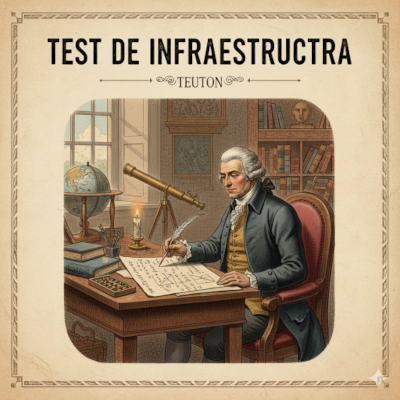
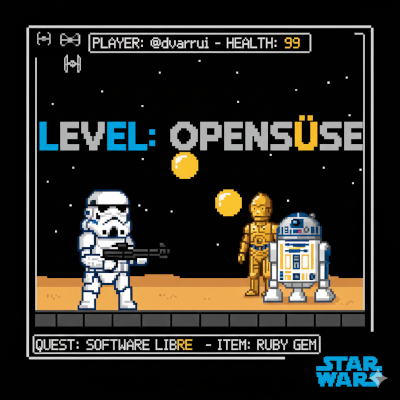
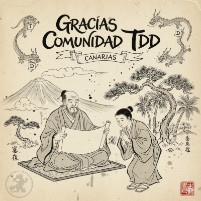
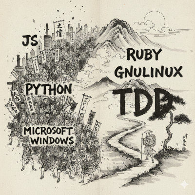
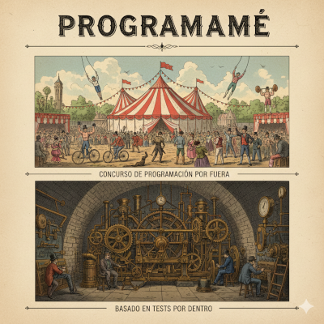

# Teuton: TDD infraestuctura

## 1. Presentación 

## 2. Agradecimientos

## 3. Programame

Concurso de programación basado en tests. Es como un juego. 

## 4. El problema

Problema a resolver:

* Ayudar al profesor
* Corrección automática en remoto para sistemas
* Filosofía devops automatizar las tareas repetitivas
* Gamificacion el reto es la práctica,  la escena de juego la máquina del alumno.

## 5 El camino

* No existe app adecuada
* Ruby one Man project.
* Software libre. 

* Historia:
    * 2016: Vesión 0.16.0
    * 2026: Versión 3.0.0 (10 años de desarrollo)
* Rubygems: https://rubygems.org/gems/teuton
* Github: https://github.com/teuton-software/teuton

## 6. Contexto

Red de equipos ssh, teuton el profe.

## 7. test + config + ssh

## 8. Ruby dsl para tests

TDD: el profesor define el tests y lis alumnos deben hacer las acciones necesarias para pasar los tests. Es como un juego.

## 9. combinar prompt de ia para crear los tests 

## 10. Otros modos de uso.

- Otros modos de uso

## 12 Muchas gracias

Datos de contacto
Preguntas
